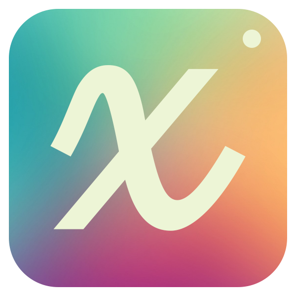
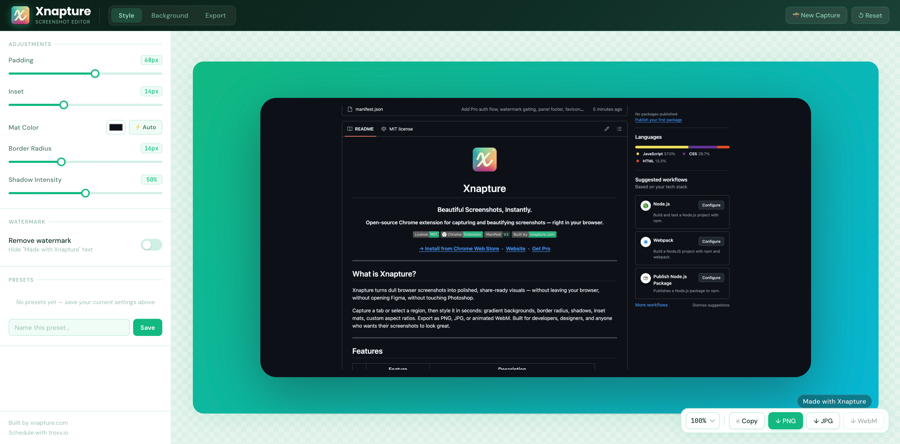

<div align="center">



# Xnapture

### Beautiful Screenshots, Instantly.

**Open-source Chrome extension for capturing and beautifying screenshots — right in your browser.**

[](LICENSE)
[](https://chromewebstore.google.com)
[](https://developer.chrome.com/docs/extensions/mv3/)
[](https://xnapture.com)

[**→ Install from Chrome Web Store**](https://chromewebstore.google.com) &nbsp;·&nbsp; [**Website**](https://xnapture.com) &nbsp;·&nbsp; [**Get Pro**](https://xnapture.com/#pricing)

---

</div>

## What is Xnapture?

Xnapture turns dull browser screenshots into polished, share-ready visuals — without leaving your browser, without opening Figma, without touching Photoshop.

Capture a tab or select a region, then style it in seconds: gradient backgrounds, border radius, shadows, inset mats, custom aspect ratios. Export as PNG, JPG, or animated WebM. Built for developers, designers, and anyone who wants their screenshots to look great.

---

## Features

| | Feature | Description |
|---|---|---|
| 📸 | **One-Click Capture** | Capture your full visible tab or drag to select any region |
| 🎨 | **Beautiful Backgrounds** | 20+ curated gradients, solid colors, custom images, animated video |
| ✨ | **Auto Shadows** | Depth-aware drop shadows that look professional instantly |
| 📐 | **Any Aspect Ratio** | 1:1, 16:9, 4:3, Twitter card, LinkedIn — or fully custom dimensions |
| 🖼 | **Inset Mat Frame** | Cinematic border around your screenshot with auto color-detect |
| ⚡ | **Instant Export** | Download PNG, JPG, WebM video, or copy directly to clipboard |
| 💾 | **Presets** | Save your favorite styles and apply them in one click |
| 🔒 | **100% Local** | Screenshots never leave your device. Zero data collection. |

---

## Screenshot



---

## Quick Start

**Install from the Chrome Web Store:**

1. Click [Add to Chrome](https://chromewebstore.google.com)
2. Click the Xnapture icon in your toolbar
3. Choose **Capture Screen** or **Select Region**
4. Style your screenshot and export

No account required. Works on any website.

---

## Pro

The free version includes everything except one thing: the "Made with Xnapture" watermark on exports.

**[Pro](https://xnapture.com/#pricing) removes it — one-time payment, lifetime access, no subscription.**

The upgrade flow is built into the extension itself:
1. Click the **Remove Watermark** toggle
2. Enter your email — a magic link is sent
3. Click the link, complete checkout ($9)
4. Pro activates instantly in the extension

No license keys. No friction. Your Pro status is tied to your email — restore it on any device, anytime.

---

## Why Open Source?

We believe tools you put inside your browser should be **auditable**.

You can read every line of Xnapture's code right here. There are no hidden trackers, no screenshot uploads, no analytics, no telemetry. What you see is what runs.

Open source also means:
- **Trust** — verify the extension does exactly what it says
- **Community** — report bugs, suggest features, or contribute improvements
- **Longevity** — if we ever stop maintaining it, the community can fork it

The only part that isn't open source is the backend (auth + payments), because that contains business logic and credentials. But the extension itself — the part that runs in your browser — is fully open.

---

## Architecture

```
xnapture/
├── manifest.json              # Chrome MV3 manifest
├── popup/
│   ├── popup.html             # Extension toolbar popup
│   ├── popup.js               # Capture triggers (full screen / region)
│   └── popup.css
├── background/
│   └── service-worker.js      # Screenshot capture, crop, Pro auth flow
├── content/
│   ├── selection.js           # Region selection overlay (injected into pages)
│   └── selection.css
├── dashboard/
│   ├── dashboard.html         # Full-page screenshot editor
│   ├── dashboard.js           # All editor logic — state, preview, export
│   └── dashboard.css
└── assets/
    └── icons/                 # Extension icons
```

**How it works:**

1. User clicks the popup → service worker captures the tab via `chrome.tabs.captureVisibleTab`
2. For region capture, a selection overlay is injected into the page via content script
3. Screenshot is cropped and stored in `chrome.storage.session` as a data URL
4. Dashboard opens in a new tab, loads the screenshot, and renders the live editor
5. All export (PNG/JPG/WebM/clipboard) is done entirely client-side using Canvas API

---

## Tech Stack

| Layer | Technology |
|---|---|
| Extension | Chrome MV3, Vanilla JS, CSS custom properties |
| Canvas rendering | OffscreenCanvas, Canvas 2D API |
| Pro auth | `chrome.identity.launchWebAuthFlow` + magic links |
| Backend | Next.js (App Router) on Vercel |
| Database | Supabase (Postgres) |
| Payments | Stripe (one-time checkout) |
| Email | Resend |
| Session | JWT via `jose` (30-day expiry) |

---

## Contributing

Contributions are welcome. If you've found a bug, have a feature idea, or want to improve something:

1. [Open an issue](https://github.com/arrafaqat/xnapture/issues) to discuss it first
2. Fork the repo and create a branch
3. Make your changes
4. Open a pull request

For anything security-related, please email **support@xnapture.com** instead of opening a public issue.

---

## Privacy

Xnapture takes privacy seriously:

- **No screenshots are ever uploaded.** All processing happens locally in your browser.
- **No analytics or tracking** of any kind inside the extension.
- **No third-party scripts** injected into the pages you visit.
- The only network requests the extension makes are to `xnapture.com` — and only when you explicitly trigger the Pro auth flow.

You can verify all of this by reading the source.

---

## License

MIT — free to use, modify, and distribute. See [LICENSE](LICENSE) for details.

If you build something with Xnapture or fork it, a mention or a star would be appreciated. 🙂

---

<div align="center">

Built by [xnapture.com](https://xnapture.com) &nbsp;·&nbsp; Schedule with [trovv.io](https://trovv.io)

</div>
